# Fail Fast in SaaS (done right)

> "Fail fast — avoid analysis paralysis. It’s SaaS; refactor if you fail."

The mantra captures the advantages of continuous delivery and rapid iteration, but it must be applied with care. This note explains where the principle applies, where it doesn’t, and how successful SaaS organizations balance speed with stability.

## 1. Why "fail fast" works in SaaS

SaaS products are uniquely suited for rapid iteration because of their delivery model and cloud‑native tooling:

## 2. Benefits of failing fast

## 3. Caveats — where "fail fast" is risky

Some areas of SaaS systems cannot be treated as "just refactor later" because errors carry long‑term consequences:

## 4. How SaaS leaders balance it

Successful SaaS companies adopt a dual‑speed approach:

**Fail fast on**

**Plan carefully for**

> Refined mantra: fail fast where reversible; design carefully where irreversible.

## 5. Practical implementation

## Conclusion

Fail fast is indeed a well-followed mantra in successful SaaS implementations. The key is to distinguish between areas where failure is a cheap, reversible learning opportunity and areas where failure is costly and hard to undo.

SaaS leaders succeed by moving fast in product experiments while engineering stability into critical platform layers.

## Visual guide

```mermaid
flowchart LR
  %% Arrange as 2x2 by linking left->right and top->bottom

  subgraph PC[Plan Carefully]
    direction TB
    N1["1. Compliance posture"]
    N2["2. Data model & tenancy"]
    N3["3. Identity & SSO"]
    N4["4. Billing & entitlements"]
    N5["5. Data migrations"]
    N6["6. Domain contracts & APIs"]
    N7["7. Multi-region architecture"]
    N8["8. Platform limits"]
  end

  subgraph PWC[Proceed with Caution]
    direction TB
    N9["9. Operational runbooks & SLOs"]
    N10["10. Infra as Code changes"]
    N11["11. Caching strategy"]
    N12["12. Canary strategy & rollout"]
  end

  subgraph CM[Change Management]
    direction TB
    N13["13. Internal tooling"]
    N14["14. Feature flags/toggles"]
    N15["15. UI/UX experiments"]
    N16["16. Docs & help content"]
  end

  subgraph FF[Fail Fast]
    direction TB
    %% Intentionally left minimal; items above typically fall here when reversible and low blast radius
  end

  %% Layout nudges
  PC --> PWC
  CM --> FF
  PC --- CM
  PWC --- FF
```

### Legend
| #  | Item                                                        |
| -- | ----------------------------------------------------------- |
| 1  | Compliance posture (GDPR/SOC2/HIPAA controls)               |
| 2  | Data model & tenancy (schema, partitioning, PII boundaries) |
| 3  | Identity & SSO flows (authN/Z, SAML/OIDC, token lifetimes)  |
| 4  | Billing & entitlements (pricing, metering, invoicing)       |
| 5  | Data migrations (backfills, retention policies)             |
| 6  | Domain contracts & APIs (versioning, SLAs, deprecation)     |
| 7  | Multi-region architecture (failover, RTO/RPO)               |
| 8  | Platform limits (rate limits, quotas)                       |
| 9  | Operational runbooks (alerts, SLO thresholds)               |
| 10 | Infra as Code changes (scaling, node pools)                 |
| 11 | Caching strategy (TTLs, invalidation hooks)                 |
| 12 | Canary strategy & rollout (progressive delivery)            |
| 13 | Internal tooling (devex, dashboards)                        |
| 14 | Feature flags/toggles (scoped cohorts)                      |
| 15 | UI/UX experiments (copy, layout, onboarding)                |
| 16 | Docs & help content                                         |

### How to read it

• X-axis (Reversibility): How cheaply and quickly can we roll back or change course?

• Y-axis (Blast Radius): How many users/systems are impacted when it goes wrong?

• Top-left (Plan Carefully): Low reversibility and high blast radius → invest in design, review, and testing.

• Bottom-right (Fail Fast): High reversibility and low blast radius → iterate quickly with canaries/flags.

### Quick decision checklist

#### Reversibility
- Can we toggle it off with a flag?
- Is there a simple rollback (schema versioned, API compat)?
- Will data be permanently altered?

#### Blast radius
- Does it touch auth, billing, PII, or critical workflows?
- Is the change cross-tenant or cross-region?
- What percent of traffic/users will see it initially?

#### Guardrails
- Feature flag scoped to small cohorts
- Canary + automatic rollback on SLO breach
- Observability in place (dashboards, alerts, traces)

> Rule of thumb: Fail fast where reversible; design carefully where irreversible.

### Implementation patterns (by quadrant)

#### Plan Carefully
- Formal design doc, threat model, schema evolution plan
- ADR (Architecture Decision Record) + security review
- Migration playbooks with dry-runs and back-out

#### Proceed with Caution
- Shadow reads/writes, dark launches
- Contract tests and consumer-driven versioning
- Staged rollout with SLO guards

#### Change Management
- Infrastructure/scaling changes behind autoscaling and limits
- SLO-aware rollouts and tight alert loops
- Clear rollback and capacity headroom

#### Fail Fast
- A/B tests, rapid UI cycles, copy tweaks
- Kill-switches, instant rollback
- Post-release analytics to learn and iterate

### Minimum risk score

`Risk = (1 - Reversibility) * 0.6 + BlastRadius * 0.4`

Decision guide:
- Risk ≥ 0.7 → Plan Carefully
- 0.5–0.7 → Proceed with Caution
- 0.3–0.5 → Change Management
- < 0.3 → Fail Fast

Use this as a lightweight rubric during grooming/design reviews.

### Notes for teams

- Keep feature flags first-class (lifecycle, ownership, expiry)
- Treat schema changes as products: version, deprecate, migrate
- Bake in observability: every change should be measurable
- Capture decisions in ADRs to avoid re-litigating choices

