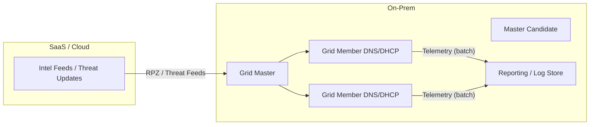
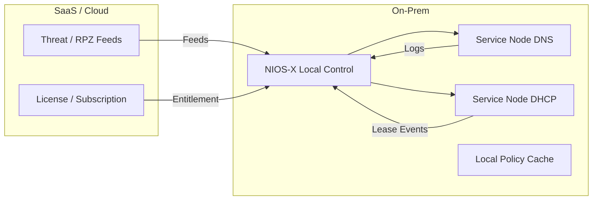
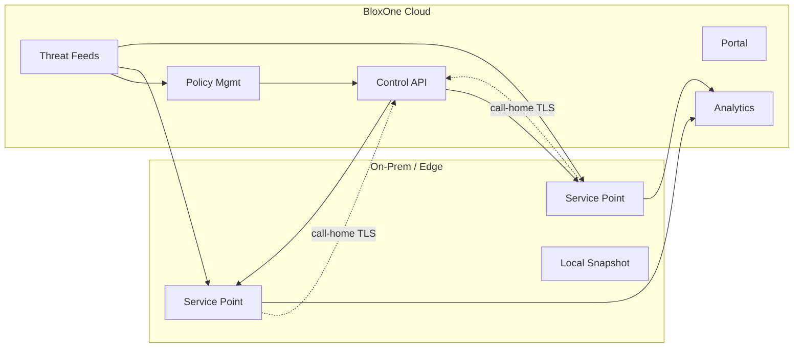
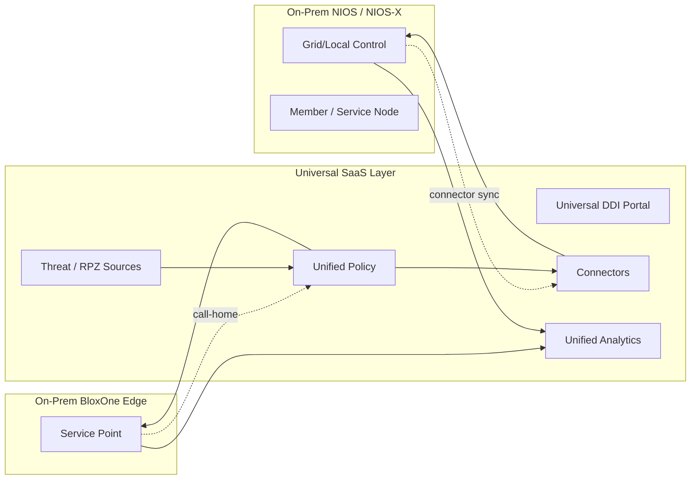
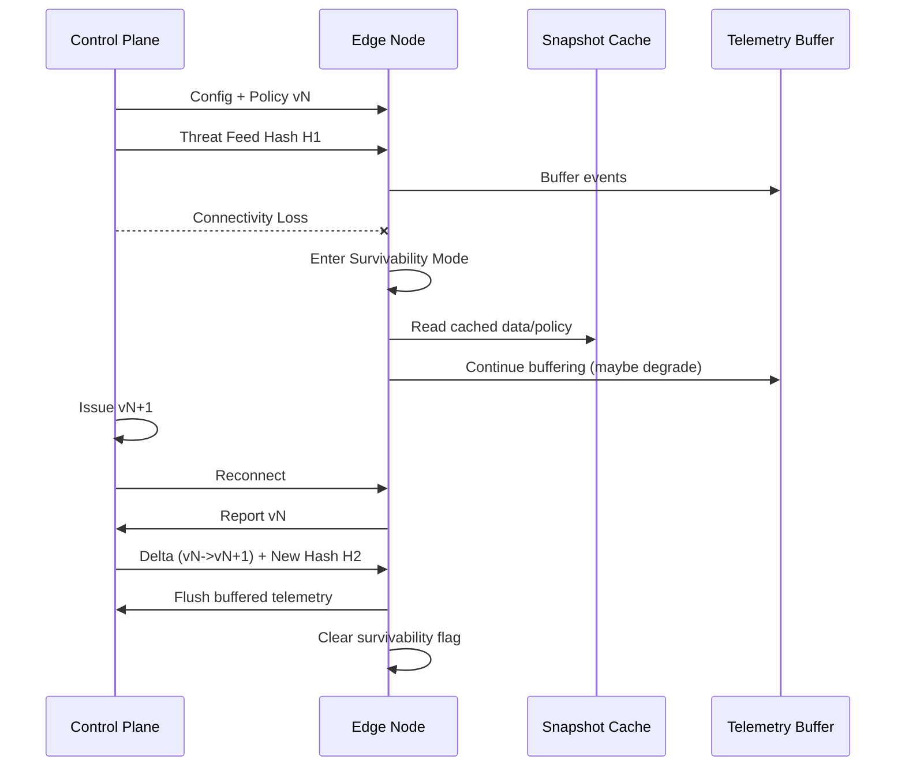

## Local Survivability in DDI (DNS, DHCP, IPAM)

This document is split into two major sections:
1. Conceptual, neutral view (technology/vendor agnostic)
2. Infoblox-specific mapping (how common Infoblox architectures address the concepts)

---

## 1. Conceptual (Neutral) Section

### 1.1 Definition
Local Survivability is the ability of a geographically distributed site (branch, edge node, remote data center, MEC cell) to continue delivering essential DDI services (authoritative DNS, DNS recursion/forwarding, DHCP renewals and controlled new leases, minimal IPAM awareness, and policy enforcement snapshots) when disconnected from a central control plane, Grid master, or orchestration system. The goal is graceful degradation instead of total service outage.

### 1.2 Core Objectives
- Maintain critical name resolution (internal + key external/SaaS domains).
- Allow DHCP lease renewals (and optionally constrained new leases) to avoid client outages.
- Enforce last-known-good security / response / access policies within expiry tolerances.
- Prevent configuration divergence or split-brain upon reconnection.
- Provide auditable recovery and reconciliation.

### 1.3 Problem Drivers
- WAN instability / brownouts
- Planned control-plane maintenance or upgrade windows
- Security isolations / segmented operations (containment events)
- Cloud dependency minimization for regulated or mission-critical sites

### 1.4 Architectural Building Blocks
| Element | Purpose | Typical Techniques |
|---------|---------|--------------------|
| Pre-positioned Data | Ensure service continuity offline | Periodic replication, zone transfers, object deltas |
| Local Policy Cache | Security & DNS firewall continuity | Snapshot RPZ/ACL feeds with freshness metadata |
| Call-Home Channel | Outbound-only control & telemetry path | Polling, long-lived TLS tunnel, exponential backoff |
| Mode Detection | Decide when to enter survivability mode | Heartbeat timeouts, missed version increments |
| Write Control Gate | Block or queue risky mutations | Read-only toggle, journal / WAL queue |
| Reconciliation Engine | Safe reintegration after outage | Version vectors, hash diff, conflict discard rules |

### 1.5 Modes of Operation
1. Normal: Fully connected; real-time config/event propagation.
2. Latent / Degraded: Increased round-trip delay; optimistic caching; slower sync.
3. Survivability (Disconnected): Outbound control channel unavailable; serve from cache + replicated data; restrict writes.
4. Recovery: Connectivity restored; reconcile data, flush logs, validate integrity.

### 1.6 DNS Behavior in Survivability Mode
- Authoritative zones: Served using last synchronized SOA/records; TTLs honored; negative caching preserved until expiry.
- Recursive resolution: Continue using cached responses; forwarders reachable? If not, attempt root/hint fallback only if policy allows.
- DNSSEC: Use pre-fetched keys; suspend signing key rollover operations that require coordination.

### 1.7 DHCP Behavior
- Lease Renewals (REQUEST/ACK) honored if within lease validity period.
- Rebinding supported using existing range metadata.
- New leases: Either (a) allowed if free addresses known and policy marks range as safe, or (b) restricted to renewal-only mode to prevent exhaustion or conflicting future allocations.
- No structural edits to scopes, options, or reservations offline (unless specifically journaled).

### 1.8 IPAM / State Mutation Strategy
- Avoid authoritative structural changes offline (new networks, zones, fixed addresses) to eliminate conflict windows.
- If business requires limited offline writes: journal them with unique monotonic IDs and perform: validate → replay → confirm.
- Abort replay if central object revision > local queued revision (conflict precedence to central).

### 1.9 Policy & Security Enforcement Offline
- Use last-known-good snapshots (ACLs, RPZ / threat feeds, conditional forward rules).
- Attach freshness metadata: last_updated_timestamp + max_staleness_threshold.
- If threshold exceeded, either (a) continue with warning (risk-tolerant) or (b) downgrade enforcement (fail-safe) or (c) hard fail (deny) for high-assurance contexts.

### 1.10 Observability & Telemetry Buffering
- Buffer DNS query logs, DHCP lease events, security hits.
- Implement back-pressure: move from full logging → sampled logging → counters-only as disk thresholds approach.
- Use content-addressed or chunked compression for batch flush after reconnect.

### 1.11 Integrity & Trust Model
- Principle of Least Authority: Edge stores only zones/networks it must serve.
- Cryptographic Identity: Each node has unique cert/key; mutual TLS for call-home.
- Time Hygiene: NTP drift detection; large drift may suspend some TTL-sensitive operations.
- Data Authenticity: Sign snapshot manifests or maintain per-object hashes.

### 1.12 Recovery & Reconciliation Flow (Happy Path)
1. Reconnect detection (successful heartbeat or tunnel reestablished)
2. Identity & version negotiation
3. Snapshot hash comparison / incremental delta request
4. Apply central superseding changes
5. Replay local journaled safe mutations (if any)
6. Flush buffered telemetry & mark completion
7. Clear survivability mode flags / emit audit event

### 1.13 Failure / Edge Cases
- Prolonged isolation exceeding TTLs → Some cached answers expire (serve-stale optionally allowed for defined window).
- Journal conflict → Drop local mutation, raise alert.
- Storage exhaustion → Escalate logging degradation; final resort: drop least critical telemetry first.
- Clock skew → Temporarily suspend DNSSEC signing or DHCP lease allocation adjustments.

### 1.14 Testing Scenarios
- Simulated WAN cut while high query volume.
- Lease renewal storm during disconnected window.
- RPZ / policy snapshot staleness beyond threshold.
- Reconnection with conflicting central edits.
- Disk fill pressure on telemetry partition.
- Clock skew injection.

### 1.15 Anti-Patterns
- Allowing unrestricted config edits while offline (leads to complex merges).
- Storing entire global dataset on every edge (security & blast radius issues).
- Ignoring freshness metadata for security feeds (silent risk increase).
- Implicit “serve stale forever” without visibility.
- Overloading survivability path with heavy analytics (starves core DDI).

### 1.16 Glossary
- Survivability Mode: Operational state where local services run without central coordination.
- Call-Home: Outbound control/telemetry channel initiated by edge node.
- Snapshot / Pre-positioned Data: Replicated subset required to function offline.
- Journal: Ordered log of locally queued mutations awaiting reconciliation.
- Serve-Stale: DNS practice of answering with expired records for a bounded window to preserve availability.
- RPZ: Response Policy Zone; DNS firewall mechanism for rewriting or blocking queries.
- Staleness Threshold: Maximum acceptable age of a policy or data snapshot before warning or disablement.
- Rebinding: DHCP client attempting to extend a lease after renewal attempts; broadens server search.

---

## 2. Infoblox-Specific Mapping

> NOTE: This section maps neutral concepts to commonly known Infoblox deployment patterns (traditional Grid and cloud-managed / BloxOne approaches) without exposing proprietary internals. Insert deeper internal references where marked.

### 2.1 Data Replication
- Grid Members replicate only assigned authoritative DNS zones and DHCP networks from the Grid Master / Master Candidate.
- SOA serial increments drive zone propagation; internal object revision IDs manage DHCP/IPAM changes.
- TODO: Add internal reference for partial object filtering policy. <!-- internal-ref placeholder -->

### 2.2 Survivability Triggers
- Member detects Master unreachable via missed heartbeats / control RPC timeouts.
- State surfaced in UI/API (e.g., disconnected / degraded flags) enabling operators to identify isolation.

### 2.3 DNS Behavior
- Authoritative service continues with last-synced zone database; DNSSEC keys pre-distributed allow continued validation/signing until scheduled rollover windows requiring coordination.
- Recursive / forwarding behavior depends on configured forwarders’ reachability; fallback to root hints if enabled.

### 2.4 DHCP Behavior
- Lease renewals and rebinds processed from locally held range/state data structures.
- Configuration edits (new fixed addresses, option modifications) typically blocked or deferred until connectivity returns.
- Some deployments allow controlled new leases; governance is policy-based. TODO: Clarify organization policy toggle. <!-- policy-toggle placeholder -->

### 2.5 Policy & Security (DNS Firewall / RPZ)
- Last-known RPZ feed snapshot enforced; feed update jobs fail gracefully and generate alerts while offline.
- Staleness monitoring provides visibility when feeds exceed freshness windows.

### 2.6 Call-Home Channel
- Outbound-only secure channel (Grid encrypted session or BloxOne cloud channel) used for config deltas, heartbeat, telemetry.
- Exponential backoff with jitter during outage reduces thundering herd on recovery.

### 2.7 Telemetry & Logging
- Query logs, DHCP lease events, security hits buffered; upon reconnection batch upload / analytics pipeline ingestion occurs.
- Local retention caps prevent disk exhaustion; sampling threshold escalation is configurable. TODO: Add internal config parameter names. <!-- config-names placeholder -->

### 2.8 Recovery & Reconciliation
- Differential sync (object-level delta) rather than full re-seed in most cases.
- Conflict precedence: central authoritative state overrides; local unsynced mutations dropped with audit entries.

### 2.9 Identity & Trust
- PKI-backed certificates per member; revocation handled centrally once connectivity restored.
- Time synchronization (NTP) strongly recommended; large drift triggers operational warnings.

### 2.10 Serve-Stale & TTL Handling
- Configurable serve-stale behavior (if enabled) cushions transient control-plane or upstream resolver disruptions.
- DNSSEC validation continues if key material valid and not beyond rollover grace.

### 2.11 Operational Visibility
- UI / API surfaces: last sync time, policy snapshot age, RPZ feed freshness, disconnected duration.
- Recommended dashboards: survivability duration histogram, lease renewal success rate, stale-answer count.

### 2.12 Testing & Validation (Infoblox Context)
- Lab simulation of Grid Master outage while generating mixed DNS/DHCP load.
- Measure reconvergence time (delta apply + journal flush) after restoration.
- Validate RPZ staleness alerts and re-enable feed update pipeline post recovery.

### 2.13 Extension / Future Considerations
- Adaptive lease allocation policies tied to outage duration thresholds.
- Cryptographic attestations of snapshot integrity (Merkle tree approach) for faster integrity proofs.
- Progressive backfill of telemetry prioritizing security events over raw query logs.

### 2.14 Internal TODO Placeholders
- <!-- internal-ref placeholder --> Add doc link to internal replication filtering design.
- <!-- policy-toggle placeholder --> Specify flag controlling new leases offline.
- <!-- config-names placeholder --> Insert config parameter identifiers for log sampling thresholds.

---

### 2.15 Quick Reference Mapping Table
| Neutral Concept | Infoblox Mapping (Typical) |
|-----------------|----------------------------|
| Pre-positioned Data | Grid replicated zones/DHCP networks |
| Survivability Mode | Member disconnected / degraded state |
| Journaled Mutations | Limited; most writes centralized to avoid conflicts |
| Policy Snapshot | RPZ feed + ACL + DNS config snapshot |
| Call-Home | Encrypted session to Grid Master / BloxOne controller |
| Serve-Stale | Configurable stale-answer feature (if enabled) |
| Reconciliation | Differential object replication + audit |

---

### 2.16 Deployment Models & Diagrams

Legend:
- Rectangle = Logical component
- Subgraph = Boundary (On-Prem vs SaaS)
- Dashed Arrow = Outbound call-home / telemetry
- Solid Arrow = Control/config push or data replication
- Comments below each diagram highlight survivability aspects.

#### 2.16.1 Traditional NIOS (On-Prem Grid)

Survivability: Members M1/M2 continue DNS/DHCP if GM unreachable.

#### 2.16.2 NIOS-X (On-Prem Modular)

Survivability: Service nodes run with cached config if CP loses SaaS reachability.

#### 2.16.3 NIOS-X-aaS (Control Plane in SaaS)
```mermaid
flowchart LR
	subgraph ONP[On-Prem]
		SVC1[Service Node DNS/DHCP]
		SVC2[Service Node (Optional)]
		LCACHE[Policy/Data Snapshot]
	end
	subgraph SAAS[SaaS Control Plane]
		PORTAL[Infoblox Portal]
		ORCH[Orchestration & APIs]
		POL[Policy Engine]
		ANALYTICS[Analytics / Data Lake]
		THRT[Threat Intel / RPZ]
	end
	SVC1 -. Outbound TLS .-> ORCH
	SVC2 -. Outbound TLS .-> ORCH
	THRT --> POL
	POL --> ORCH
	ORCH --> SVC1
	ORCH --> SVC2
	SVC1 --> ANALYTICS
	SVC2 --> ANALYTICS
	THRT --> SVC1
	THRT --> SVC2
```
Survivability: Service nodes answer from LCACHE; telemetry buffered pending reconnection.

#### 2.16.4 BloxOne DDI

Survivability: Service Points use SNAP to continue DNS/DHCP + policy enforcement.

#### 2.16.5 Universal DDI (Unified Portal Over Hybrid Assets)

Survivability: Native survivability per platform; unified aggregation resumes after reconnect.

#### 2.16.6 Generic Survivability Sequence


### 2.17 Topology Comparison Table
| Deployment Model | Control Plane Location | Data Plane On-Prem | Policy Source | Telemetry Destination | Survivability Mechanism | Security Feed Path |
|------------------|------------------------|--------------------|---------------|-----------------------|-------------------------|--------------------|
| NIOS (Traditional) | On-Prem (Grid Master) | Grid Members | Grid Master | On-Prem Reporting | Member offline snapshot | Feeds -> Master -> Members |
| NIOS-X | On-Prem Modular | Service Nodes + Local Control | Local Control | Local (optionally SaaS) | Service nodes + policy cache | SaaS Feeds -> Local Control |
| NIOS-X-aaS | SaaS | Service Nodes | SaaS Control Plane | SaaS Analytics | Service nodes + snapshot cache | SaaS Feeds -> Service Nodes |
| BloxOne DDI | SaaS | Service Points | SaaS Control Plane | Cloud Data Lake | Service points + local snapshot | SaaS Feeds -> Service Points |
| Universal DDI | Unified SaaS Layer | Mixed (Members, Service Nodes, Service Points) | Unified Policy Layer | Unified Analytics | Native per-platform survivability | Feeds -> Unified -> On-Prem |

---

> END OF DOCUMENT

