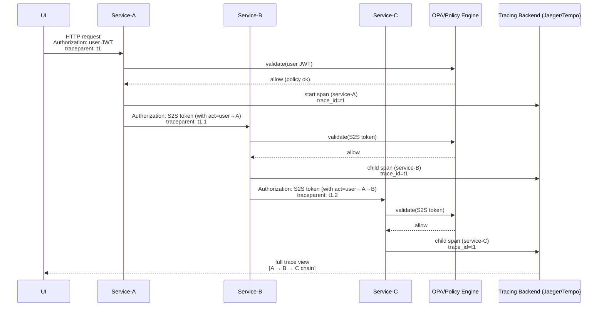

```mermaid
sequenceDiagram
    participant UI
    participant A as Service-A
    participant B as Service-B
    participant C as Service-C
    participant OPA as OPA/Policy Engine
    participant TRACE as Tracing Backend (Jaeger/Tempo)

    %% User initiates action
    UI->>A: HTTP request<br/>Authorization: user JWT<br/>traceparent: t1

    %% Auth & Trace Validation in A
    A->>OPA: validate(user JWT)
    OPA-->>A: allow (policy ok)
    A->>TRACE: start span (service-A)<br/>trace_id=t1

    %% A calls B
    A->>B: Authorization: S2S token (with act=user→A)<br/>traceparent: t1.1
    B->>OPA: validate(S2S token)
    OPA-->>B: allow
    B->>TRACE: child span (service-B)<br/>trace_id=t1

    %% B calls C
    B->>C: Authorization: S2S token (with act=user→A→B)<br/>traceparent: t1.2
    C->>OPA: validate(S2S token)
    OPA-->>C: allow
    C->>TRACE: child span (service-C)<br/>trace_id=t1

    %% Trace aggregation
    TRACE-->>UI: full trace view<br/>[A → B → C chain]
```